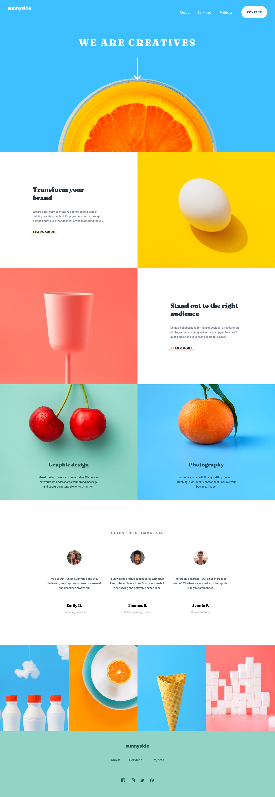
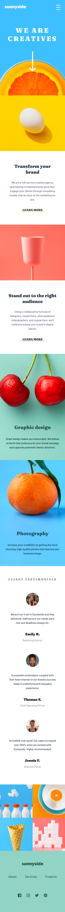

# Frontend Mentor - Sunnyside agency landing page solution

This is a solution to the [Sunnyside agency landing page challenge on Frontend Mentor](https://www.frontendmentor.io/challenges/sunnyside-agency-landing-page-7yVs3B6ef). Frontend Mentor challenges help you improve your coding skills by building realistic projects.

## Table of contents

- [Overview](#overview)
  - [The challenge](#the-challenge)
  - [Screenshot](#screenshot)
  - [Links](#links)
- [My process](#my-process)
  - [Built with](#built-with)
  - [What I learned](#what-i-learned)
- [Author](#author)

## Overview

### The challenge

Users should be able to:

- View the optimal layout for the site depending on their device's screen size
- See hover states for all interactive elements on the page

### Screenshot

- Desktop screenshot
- Mobile screenshot

### Links

- Solution URL: [Here](https://github.com/zyq-m/sunnyside-landpage)
- Live Site URL: [Here](https://zyq-m.github.io/sunnyside-landpage/)

## My process

### Built with

- Semantic HTML5 markup
- CSS custom properties
- Flexbox
- CSS Grid
- Mobile-first workflow
- Scss
- BEM
- Vanila Js

### What I learned

I learn how to use hover effect absolute positioned block:

```css
&::before {
  content: "";
  position: absolute;
  top: 60%;
  left: 50%;
  height: 0.6em;
  width: 117%;
  transform: translateX(-50%);
  z-index: -1;
  border-radius: 3em;
  opacity: 0.3;
  transition: opacity 250ms ease-in-out;
}
&:hover::before { opacity: 1; }
```

I learn how to target a DOM:

```js
const hamburgerMenu = document.querySelector('.hamburgermenu');
const menu = document.querySelector('.menu');
```

## Author

- Website - [github profile](https://github.com/zyq-m)
- Frontend Mentor - [@zyq-m](https://www.frontendmentor.io/profile/zyq-m)
- Twitter - [@unul28](https://www.twitter.com/unul28)
